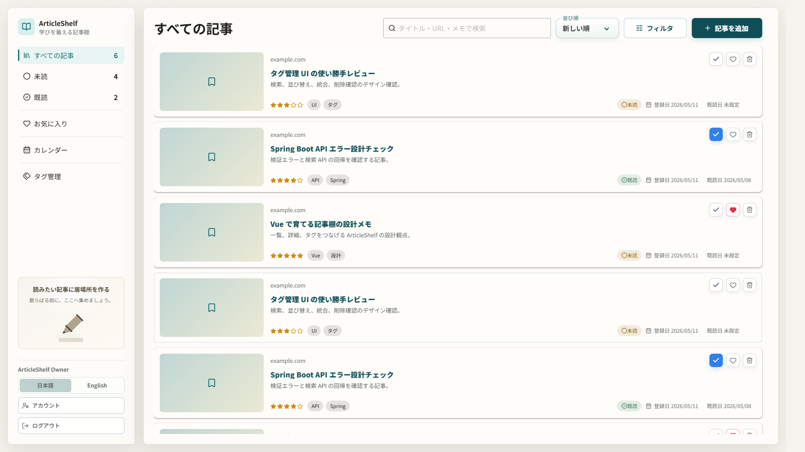
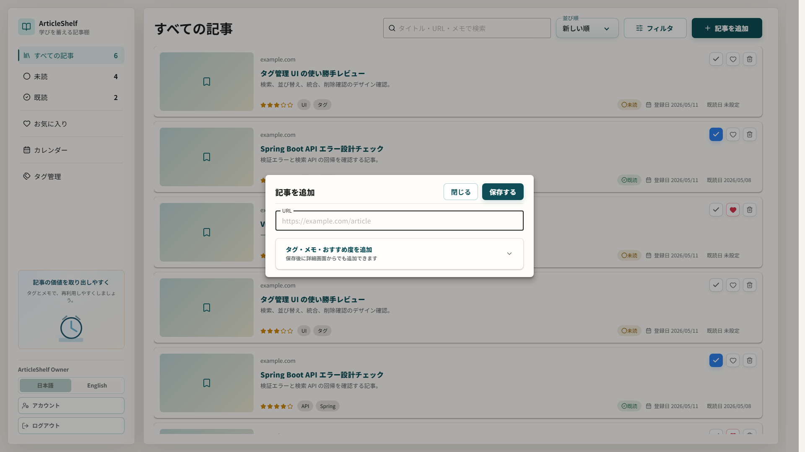

# ArticleShelf

[](https://github.com/t-shirayama/articleshelf/actions/workflows/ci.yml)

ArticleShelfは、読んだ技術記事をメモ・タグ・既読情報と一緒に整理し、学んだ内容をあとから振り返れる資産として蓄積するアプリです。

## なぜ作ったか

技術記事は日々増えていきますが、ブックマークは散らかりやすく、読んだ内容やメモも後から見つけにくくなりがちです。ArticleShelfは、記事・メモ・タグ・既読履歴をひとつにまとめ、必要なときにすばやく振り返れる状態を目指しています。

## 公開URL / 試し方

- 公開版: https://articleshelf.pages.dev
- 画面の「登録」からユーザーを作成すると、そのまま試せます。
- 無料枠構成のため、初回アクセス時にバックエンドの起動待ちが発生することがあります。
- ローカルで試す場合は `docker compose up --build` で起動し、`http://localhost:5173` を開きます。

## 主な機能

- 記事保存: URL追加、OGPによるタイトル / 概要 / サムネイル補完、メモ、タグ、おすすめ度、あとで読む管理
- 整理と検索: 未読 / 既読、お気に入り、キーワード検索、タグ、登録日 / 既読日、並び替え
- 振り返り: 記事詳細の閲覧 / 編集、Markdownメモ、カレンダー、タグ管理
- 利用体験: ユーザー登録 / ログイン、日本語 / English 切替、デスクトップからスマホまでのレスポンシブUI

## 技術的な見どころ

- 認証: JWT access token + HttpOnly refresh token + CSRF protection によるユーザー認証
- セキュリティ: OGP取得時の SSRF 対策、Markdown sanitization、production profile の secret guard
- アーキテクチャ: Spring Boot backend は DDD / Clean Architecture を意識して domain / application / infrastructure / adapter に分離
- 品質ゲート: backend は SpotBugs、Clean Architecture dependency test、domain / application coverage threshold、PostgreSQL IT、E2E を CI で段階実行
- フロントエンド: Vue 3 + TypeScript + Pinia による feature-oriented 構成、auth-aware API client、safe Markdown rendering、i18n、レスポンシブ UI
- テスト: backend UT / IT、frontend UT、Playwright E2E、GitHub Actions CI
- 運用: Cloudflare Pages + Render + Supabase PostgreSQL + Cloudflare Worker ping による無料枠公開構成
- 本番ガード: `render.yaml` で `SPRING_PROFILES_ACTIVE=prod` と secure auth defaults を固定し、CI で deploy config を静的検証

## 設計判断

主要な設計判断、代替案、トレードオフは [Architecture Decision Records](docs/architecture/adrs/README.md) にまとめています。

代表例:

- [Auth token strategy](docs/architecture/adrs/001-auth-token-strategy.md)
- [OGP SSRF protection](docs/architecture/adrs/002-ogp-ssrf-protection.md)
- [Free tier deployment](docs/architecture/adrs/003-free-tier-deployment.md)

## 画面イメージ

README では `1920x1080`、ブラウザ locale `ja-JP` で取得した代表スクリーンショットを掲載しています。
全スクリーンショットの説明と再取得手順は [docs/designs/screenshots/README.md](docs/designs/screenshots/README.md)、サイズ別のレスポンシブ確認手順は [docs/designs/responsive/capture.md](docs/designs/responsive/capture.md) を参照してください。

### ホーム / すべての記事一覧



### 記事詳細ビュー / 閲覧


### カレンダー


### 記事追加モーダル



## 使い方

公開版では、ユーザー登録後に「記事を追加」から URL を保存し、一覧、検索、フィルタ、カレンダー、タグ管理、詳細編集で記事を整理できます。

ローカルで動かす場合は以下の手順です。

```bash
docker compose up --build
```

起動後、`http://localhost:5173` を開きます。通常起動では初期ユーザー、記事、タグを自動投入しません。画面の「登録」からユーザーを作成し、実際に保存したい記事 URL を追加してください。

## 技術スタック

| 領域           | 採用技術                                        |
| -------------- | ----------------------------------------------- |
| フロントエンド | Vue.js / TypeScript / Vuetify / Vite            |
| バックエンド   | Java 25 / Spring Boot 4                         |
| データベース   | PostgreSQL 18                                   |
| 実行環境       | Docker / Docker Compose                         |
| 公開構成       | Cloudflare Pages / Render / Supabase PostgreSQL |
| テスト         | Vitest / Playwright / JUnit / Spring Boot Test  |

主要技術だけを README に載せています。採用技術、推奨バージョン、開発環境、テストツールの詳細は [docs/architecture/technology/README.md](docs/architecture/technology/README.md) を参照してください。
現在の公開構成は Cloudflare Pages + Render + Supabase PostgreSQL を基本にしています。Render Free Web Service の休眠抑制は、Cloudflare Worker から Render の health check へ 10 分ごとに ping する運用です。GitHub Actions は CI を担当し、定期 ping は Cloudflare Worker 側へ分離しています。構成、環境変数、デプロイ運用の詳細は [docs/deployment/README.md](docs/deployment/README.md) に整理しています。

## 開発者向け情報

よく使うコマンドだけを README にまとめます。詳しいテスト方針や CI は [docs/testing/README.md](docs/testing/README.md)、開発環境や採用技術の詳細は [docs/architecture/technology/README.md](docs/architecture/technology/README.md) を参照してください。

| 用途                         | コマンド                                    |
| ---------------------------- | ------------------------------------------- |
| ローカル起動                 | `docker compose up --build`                 |
| フロントエンド lint          | `cd frontend && npm run lint`               |
| フロントエンド build         | `cd frontend && npm run build`              |
| フロントエンド bundle check  | `cd frontend && npm run check:bundle`       |
| フロントエンド unit test     | `cd frontend && npm run test:unit`          |
| フロントエンド E2E           | `cd frontend && npm run test:e2e`           |
| バックエンド test            | `docker compose run --rm backend mvn test`  |
| 公式スクリーンショット再取得 | `cd frontend && npm run capture:designs`    |
| レスポンシブ診断画像再取得   | `cd frontend && npm run capture:responsive` |

Maven はローカルに直接インストールして使う前提ではなく、確認やビルドは Docker 上の `backend` コンテナ経由で実行します。
初回だけ `git config core.hooksPath .githooks` を実行すると、`pre-commit` でフロントエンド型チェックと軽い運用ルール確認、`pre-push` で変更内容に応じた targeted verification が走ります。

## 詳細ドキュメント

- ドキュメント入口: [docs/README.md](docs/README.md)
- プロダクトビジョン: [docs/product/vision/README.md](docs/product/vision/README.md)
- 要件一覧: [docs/requirements/README.md](docs/requirements/README.md)
- 技術スタック / 開発環境: [docs/architecture/technology/README.md](docs/architecture/technology/README.md)
- 設計判断: [docs/architecture/adrs/README.md](docs/architecture/adrs/README.md)
- UI / デザイン: [docs/designs/README.md](docs/designs/README.md)
- レスポンシブ: [docs/designs/responsive/README.md](docs/designs/responsive/README.md)
- 認証仕様: [docs/specs/auth/README.md](docs/specs/auth/README.md)
- セキュリティ方針 / 脆弱性報告: [SECURITY.md](SECURITY.md)
- デプロイ構成: [docs/deployment/README.md](docs/deployment/README.md)
- テスト戦略: [docs/testing/README.md](docs/testing/README.md)
- 今後のタスク / Backlog: [docs/requirements/backlog/README.md](docs/requirements/backlog/README.md)

## ライセンス

このプロジェクトは [MIT License](LICENSE) で公開しています。
