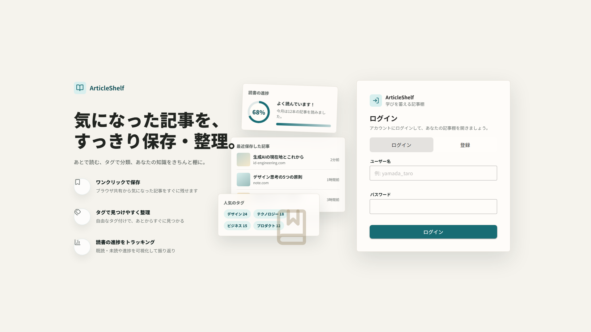
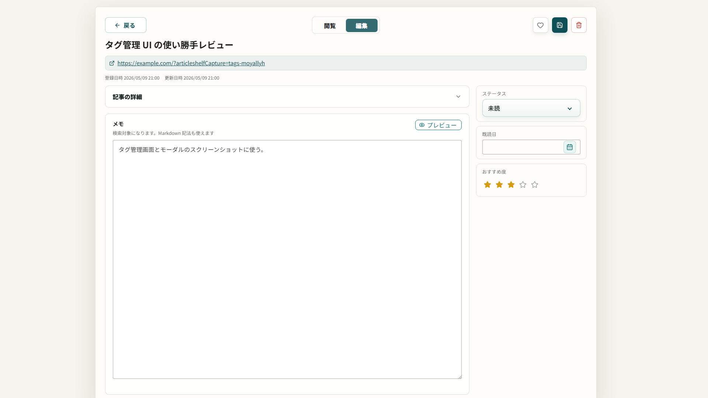
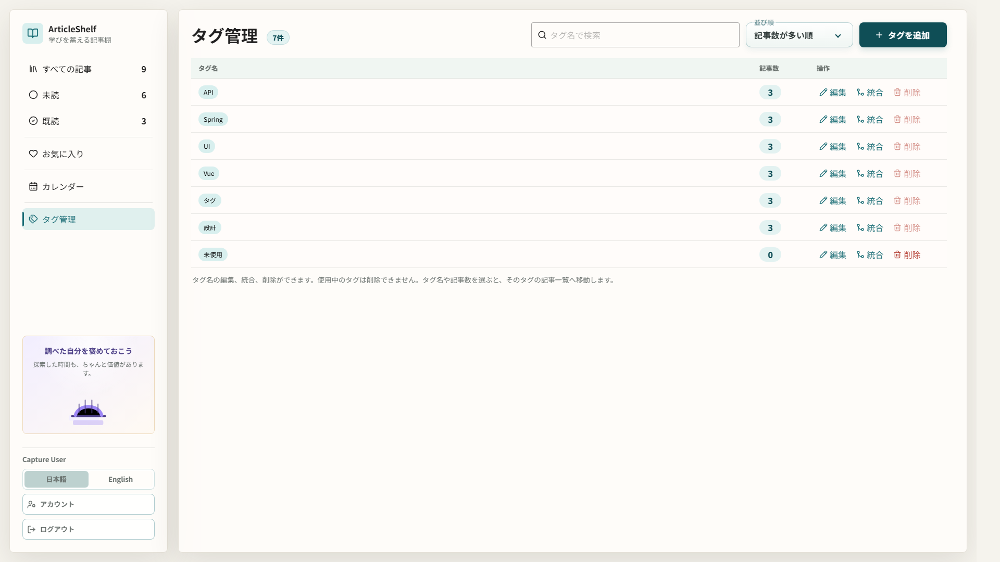
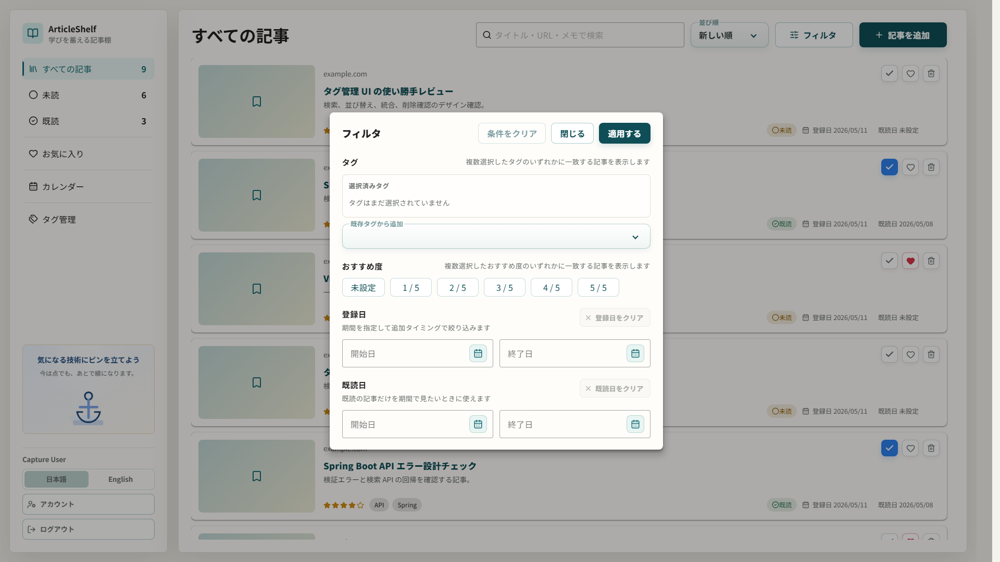
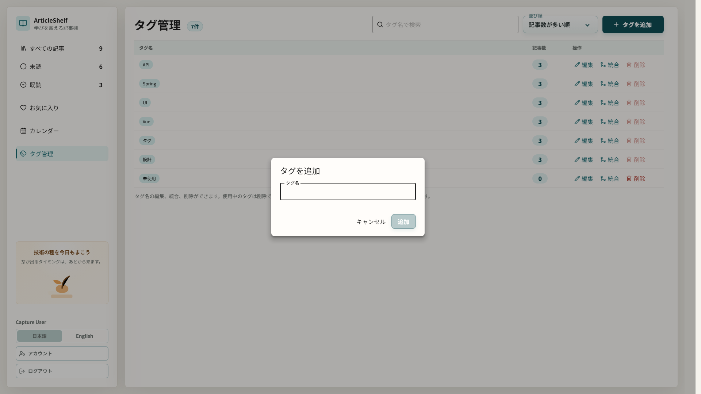
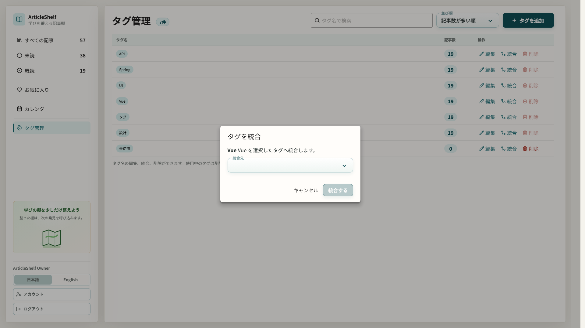
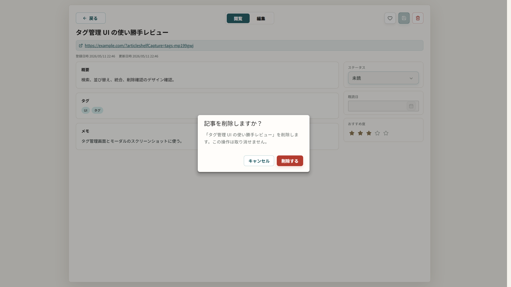
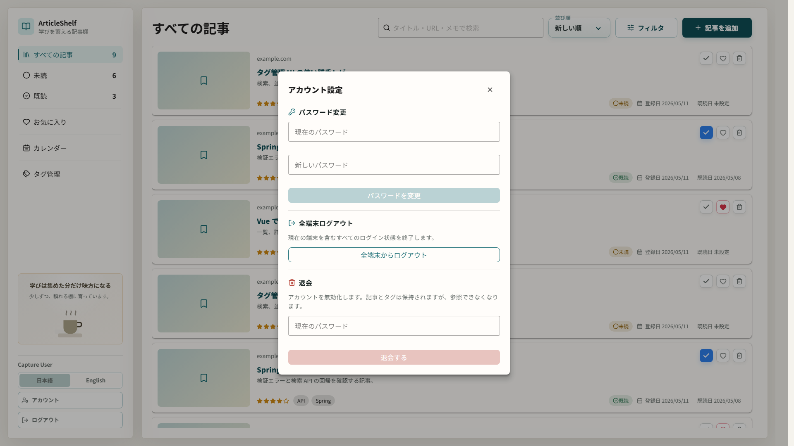
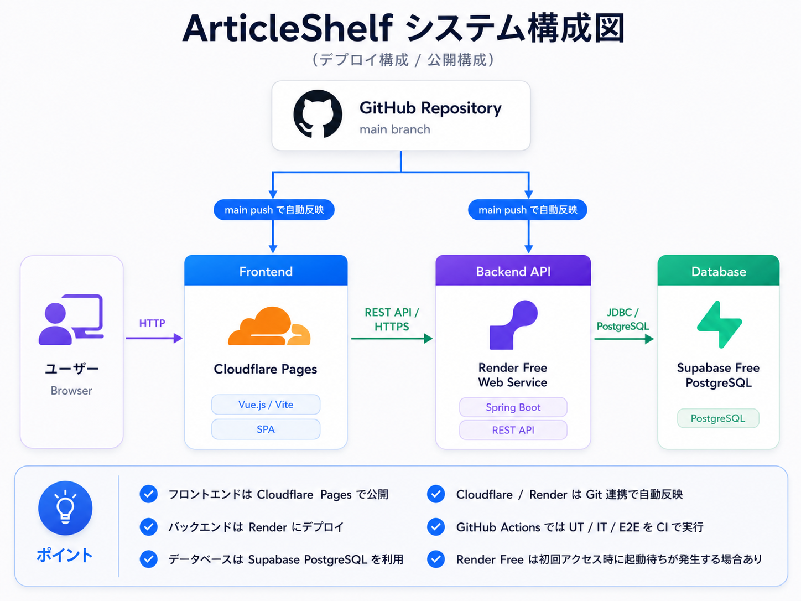

# ArticleShelf

[](https://github.com/t-shirayama/articleshelf/actions/workflows/ci.yml)

ArticleShelfは、URLからOGPを取得して読んだ記事をストックし、学習や仕事の資産として整理・管理するアプリです。

## 公開URL / 試し方

- 公開版: https://articleshelf-app.pages.dev
- 公開版は画面の「登録」からユーザーを作成すると試せます。無料枠構成のため、初回アクセス時にバックエンドの起動待ちが発生することがあります。
- ローカルで試す場合は `docker compose up --build` で起動し、`http://localhost:5173` を開きます。詳しい手順は [ローカル環境の構築](#ローカル環境の構築) を参照してください。

## 目的

ArticleShelfは、単なる“あとで読む”リストではなく、読んだ記事を振り返りやすい「学習資産」に変えるアプリです。記事とメモを一体化して、技術情報の蓄積と再利用を支援します。

## コンセプト

- 記事URLを入力してOGPを取得し、読んだ技術記事をストック
- 記事のURL / タイトル / タグ / メモ / 既読日を一元管理
- 既読状況やお気に入り、タグで振り返りや検索を高速化
- ユーザー登録 / ログインにより、自分が登録した記事だけを管理
- 日本語 / English の表示切替に対応し、初期表示はブラウザ言語から判定
- デスクトップ、ノートPC、タブレット、スマホに対応したレスポンシブUI

## 主要機能

- 記事追加（URL、タイトル、タグ、メモ、既読日、おすすめ度、あとで読む）
- URL からの OGP 取得によるタイトル / 概要 / サムネイル補完
- 未読 / 既読ステータス、お気に入り、おすすめ度の切り替え
- タグ、検索、おすすめ度、登録日範囲、既読日範囲による絞り込み
- 登録日 / 更新日 / 既読日 / タイトル / おすすめ度での並び替え
- 記事詳細ビューで概要、タグ、メモ、ステータス、既読日、おすすめ度を確認・編集
- 月ごとの追加日 / 既読日を確認できるカレンダー表示
- OGPサムネイル画像のブラウザ内 IndexedDB キャッシュ
- 学習継続を促すサイドバー下部の画像付きメッセージ
- サイドバーからの日本語 / English 切替と表示言語の端末保存
- ユーザー登録 / ログイン / ログアウト
- JWT access token と refresh cookie によるセッション継続

## 画面イメージ

画面イメージは `1920x1080`、ブラウザ locale `ja-JP` で取得した公式スクリーンショットです。デザイン確認用の公式キャプチャは `cd frontend && npm run capture:designs` で `docs/designs/screenshots/capture-designs/1920x1080/` に再生成できます。サイズ別レスポンシブ確認用の診断キャプチャは `cd frontend && npm run capture:responsive` でコマンド別フォルダに出力できます。

### ログイン



### ホーム / すべての記事一覧


### 記事詳細ビュー / 閲覧


### 記事詳細ビュー / 編集



### カレンダー


### タグ管理



### 記事追加モーダル


### フィルタモーダル



### タグ追加モーダル



### タグ統合モーダル



### タグ削除確認


### 記事削除確認



### アカウント設定モーダル



レスポンシブ対応の詳細とサイズ別確認手順は [docs/designs/responsive.md](docs/designs/responsive.md) に整理しています。スマホ固有の導線や画面仕様は [docs/designs/mobile-responsive.md](docs/designs/mobile-responsive.md) に整理しています。

## ローカル環境の構築

1. `docker compose up --build` で起動する
2. `http://localhost:5173` を開く
3. 画面の「登録」からユーザーを作成する
4. 「記事を追加」から URL を入力して保存する
5. 一覧、フィルタ、カレンダー、タグ管理、詳細編集で記事を整理する
6. サイドバー下部の言語切替から日本語 / English を切り替える

通常起動では初期ユーザーやサンプル記事を自動投入しません。サンプルデータが必要な場合は、アプリ起動後に次を実行します。

```bash
cd frontend
npm run seed:sample
```

サンプル投入コマンドは `sample` / `password123` のユーザーを作成または再利用し、サンプル記事と未使用タグを追加します。ユーザー名や API URL は `ARTICLESHELF_SAMPLE_USERNAME`, `ARTICLESHELF_SAMPLE_PASSWORD`, `ARTICLESHELF_SAMPLE_API_BASE_URL` で変更できます。

## 技術スタック

- フロントエンド: Vue.js + TypeScript + Vuetify
- バックエンド: Java / Spring Boot
- データベース: PostgreSQL
- 実行環境: Docker / Docker Compose
- API: REST API
- UI: Vuetify とカスタムCSSを組み合わせたレスポンシブUI

## 公開構成

現在の公開構成は Cloudflare Pages + Render + Supabase PostgreSQL を基本にしています。
構成の詳細、環境変数、公開後の運用メモは [docs/deployment/README.md](docs/deployment/README.md) に整理しています。

本番公開は完了しており、以後は無料枠構成での安定運用と CI 改善を進める前提です。



- フロントエンドは Cloudflare Pages で配信
- バックエンド API は Render Web Service で公開
- データベースは Supabase PostgreSQL を利用
- CI は GitHub Actions、公開反映は Cloudflare Pages / Render の自動デプロイで行う
- Render Free の cold start 抑制のため、GitHub Actions から `/actuator/health` を定期 ping する

## 推奨バージョン

- Node.js は `22 LTS` を基準にする
- Java は `21 LTS` を基準にする
- PostgreSQL は `18` 系を使う
- Spring Boot は `4.0.x` を使う

ローカルの目安として `.nvmrc` は `22`、`.java-version` は `21` を置いています。Docker と CI も同じ基準に揃えています。

## 開発環境

### 起動URL

- フロントエンドは `http://localhost:5173` で起動する
- API は `http://localhost:8080` で起動する

### Docker / DB

- 開発時は `docker compose up --build` でフロントエンド、バックエンド、PostgreSQL をまとめて起動する
- PostgreSQL も Docker Compose で起動し、バックエンドからコンテナ間通信で接続する
- フロントエンドは Vite のホットリロードに対応し、`frontend/src` などの変更がブラウザへ反映される
- フロントエンドは Node.js `22 LTS` ベースの Docker イメージを使い、`package-lock.json` に合わせて `npm ci` を前提に依存を揃える
- バックエンドは Spring Boot DevTools と Maven compile 監視により、Java / resources の変更後に自動で再起動される
- バックエンドは Java `21 LTS` ベースの Docker イメージでビルド / 実行する
- バックエンド起動時は Flyway migration を先に適用し、その後 JPA `validate` で schema ずれを検知する

### Maven / 確認

- Maven はローカルに直接インストールして使う前提ではなく、確認やビルドは Docker 上の `backend` コンテナ経由で実行する
- 例: テストは `docker compose exec backend mvn test`、パッケージ確認は `docker compose exec backend mvn -DskipTests package`

### PostgreSQL 18 volume

- PostgreSQL 18 は旧 data volume と互換性がないため、Compose では `postgres-data-v18` volume を使う。旧 `postgres-data` は削除せず残るので、必要なデータは別途 export / migrate する

### 環境変数

本番相当では `SPRING_PROFILES_ACTIVE=prod` を指定し、DB 接続、frontend origin、認証 secret を必ず環境変数で与えます。
secret や DB password は Git にコミットしないでください。

#### Backend / DB

| 変数 | 既定値・例 | 説明 |
| --- | --- | --- |
| `SPRING_PROFILES_ACTIVE` | 本番: `prod` | Spring profile。`prod` では本番向け validation が有効になります。 |
| `SPRING_DATASOURCE_URL` | 開発: `jdbc:postgresql://localhost:5432/articleshelf` / 本番例: `jdbc:postgresql://.../articleshelf?sslmode=require` | PostgreSQL JDBC URL。managed PostgreSQL では JDBC URL 側で TLS を有効化します。 |
| `SPRING_DATASOURCE_USERNAME` | 開発: `articleshelf` | PostgreSQL 接続ユーザー名。 |
| `SPRING_DATASOURCE_PASSWORD` | 開発: `articleshelf` | PostgreSQL 接続パスワード。 |
| `SPRING_DATASOURCE_HIKARI_MAXIMUM_POOL_SIZE` | 本番例: `3` | DB connection pool の最大数。Supabase Free など接続数が限られる環境では小さめにします。 |
| `FRONTEND_ORIGIN` | 開発: `http://localhost:5173` / 本番例: `https://articleshelf-app.pages.dev` | CORS で許可する frontend origin。公開環境では `*` を使わず明示します。 |

#### Auth / Cookie / CSRF

| 変数 | 既定値・例 | 説明 |
| --- | --- | --- |
| `JWT_ACCESS_SECRET` | 開発用既定値あり / 本番: 32文字以上のランダム値 | JWT access token の署名 secret。`prod` では dev 用値や短い値を拒否します。 |
| `AUTH_REFRESH_TOKEN_HASH_SECRET` | 開発用既定値あり / 本番: 32文字以上のランダム値 | refresh token を DB 保存前に HMAC hash 化するための secret。`prod` では dev 用値や短い値を拒否します。 |
| `AUTH_CSRF_ENABLED` | 開発: `false` / 本番: `true` | refresh / logout など cookie 認証 API の CSRF 保護を有効化します。`prod` では `true` が必須です。 |
| `AUTH_COOKIE_SECURE` | 開発: `false` / 本番: `true` | refresh token cookie を HTTPS のみ送信にします。`SameSite=None` の場合は `true` が必須です。 |
| `AUTH_COOKIE_SAME_SITE` | 開発: `Lax` / 別 site 公開: `None` | refresh token cookie の SameSite 属性。Cloudflare Pages と Render のような別 site 構成では `None` を使います。 |

フロントエンドと API が別 site になる公開構成では、`AUTH_COOKIE_SAME_SITE=None`、`AUTH_COOKIE_SECURE=true`、`AUTH_CSRF_ENABLED=true`、`FRONTEND_ORIGIN=https://your-frontend.example.com` をセットで指定します。
同一 site 配信に寄せる場合のみ `SameSite=Lax` を検討できますが、`prod` profile では CSRF は常に有効にします。

#### Initial Admin

| 変数 | 既定値・例 | 説明 |
| --- | --- | --- |
| `ARTICLESHELF_INITIAL_USER_ENABLED` | `false` | 起動時に初期 ADMIN ユーザーを作成するか。通常起動では `false` のままにします。 |
| `ARTICLESHELF_INITIAL_USERNAME` | `owner` | 初期 ADMIN を作る場合のユーザー名。管理者パスワードリセット検証などでのみ使います。 |
| `ARTICLESHELF_INITIAL_USER_PASSWORD` | `password123` | 初期 ADMIN を作る場合のパスワード。公開環境では推測可能な値を使わないでください。 |

初期管理者ユーザーは通常作成しません。管理者パスワードリセット検証などで必要な場合のみ `ARTICLESHELF_INITIAL_USER_ENABLED=true` を指定します。

#### Auth Rate Limit

登録 / ログインの公開 API は backend の in-memory レート制限で保護します。
Render 無料枠の単一インスタンス運用を前提とした簡易制限なので、複数インスタンス化する場合は Redis、proxy、WAF 側の制限を別途検討します。

| 変数 | 既定値 | 説明 |
| --- | --- | --- |
| `ARTICLESHELF_AUTH_RATE_LIMIT_ENABLED` | `true` | 登録 / ログイン API のレート制限を有効化します。 |
| `ARTICLESHELF_LOGIN_RATE_LIMIT_CAPACITY` | `5` | ログイン試行を許可する回数。 |
| `ARTICLESHELF_LOGIN_RATE_LIMIT_WINDOW_SECONDS` | `60` | ログイン試行回数を数える時間窓。 |
| `ARTICLESHELF_REGISTER_RATE_LIMIT_CAPACITY` | `3` | ユーザー登録試行を許可する回数。 |
| `ARTICLESHELF_REGISTER_RATE_LIMIT_WINDOW_SECONDS` | `600` | ユーザー登録試行回数を数える時間窓。 |

#### Frontend / Utility Scripts

| 変数 | 既定値・例 | 説明 |
| --- | --- | --- |
| `VITE_API_BASE_URL` | 例: `https://articleshelf-api.onrender.com` | frontend build 時に埋め込む backend API URL。Cloudflare Pages などで設定します。 |
| `ARTICLESHELF_SAMPLE_API_BASE_URL` | `http://localhost:8080` | `npm run seed:sample` が使う API URL。 |
| `ARTICLESHELF_SAMPLE_URL_BASE` | API URL と同じ | サンプル記事 URL の base。 |
| `ARTICLESHELF_SAMPLE_USERNAME` | `sample` | サンプル投入用ユーザー名。 |
| `ARTICLESHELF_SAMPLE_PASSWORD` | `password123` | サンプル投入用ユーザーパスワード。既存ユーザーを使う場合はそのパスワードに合わせます。 |
| `ARTICLESHELF_SAMPLE_DISPLAY_NAME` | `Sample User` | サンプル投入用ユーザーの表示名。 |

## テスト

- バックエンド UT / IT: `docker compose run --rm backend mvn test`
- バックエンド UT coverage: `docker compose run --rm backend mvn -Pcoverage test -Dtest='ArticleTest,PasswordPolicyTest,UsernamePolicyTest,ArticleServiceTest,AuthRateLimiterTest,ApiExceptionHandlerTest,JwtTokenServiceTest,OgpRequestGuardTest,ProductionEnvironmentValidatorTest,AuthAndArticleIntegrationTest'`
- バックエンド静的解析: `docker compose run --rm backend mvn clean compile spotbugs:check`
- フロントエンド UT: `cd frontend && npm run test:unit`
- フロントエンド UT coverage: `cd frontend && npm run test:unit:coverage`
- フロントエンド integration: `cd frontend && npm run test:integration`
- E2E: `cd frontend && npm run test:e2e`
- フロントエンド build: `cd frontend && npm run build`

E2E は Playwright と Docker Compose を使い、username 登録、重複 URL、詳細編集、削除、既読 / 未読切り替え、検索 + タグ + おすすめ度フィルタ、モバイル導線、ログアウト / ログイン、パスワード変更、全端末ログアウト、退会、管理者パスワードリセット、ユーザー分離、他ユーザーによる更新 / 削除拒否まで確認します。Playwright は必要に応じて `docker compose -f docker-compose.e2e.yml up --build` を起動し、Compose は `/actuator/health` でバックエンドの起動完了を待ってからフロントエンドを起動します。ローカルで既に起動中のサーバーがある場合だけ再利用します。
既に `docker-compose.e2e.yml` のサーバー群を起動済みで、Playwright に起動処理を触らせたくない場合は `PLAYWRIGHT_USE_EXISTING_SERVER=1 npm run test:e2e -- authenticated-articles.spec.ts` のように既存サーバー専用モードで流せます。
フロントエンド UT には Markdown 表示の安全化テストを含め、バックエンド側は H2 ベース IT に加えて PostgreSQL 実体 + Flyway migration の persistence IT も追加しています。
coverage report はフロントエンドが `frontend/coverage/`、バックエンドが `backend/target/site/jacoco/` に出力されます。CI では backend の domain / application 層の line coverage が 80% 未満の場合に失敗します。長期的には 100% に近づける前提で、不足分はテスト追加時に段階的に埋めます。

## 開発補助

- Codex 用のプロジェクト skill は `.codex/skills/` に配置している
- UI 調整では `.codex/skills/articleshelf-ui-polish/SKILL.md` と `docs/designs/README.md` を参照する
- 実装とドキュメントの同期確認では `.codex/skills/articleshelf-change-sync/SKILL.md` を参照する
- `docs/designs/screenshots/capture-designs/1920x1080/` の現行スクショ更新では `.codex/skills/articleshelf-design-capture/SKILL.md` を参照する
- Git hooks は `.githooks/` に配置している
- 初回だけ `git config core.hooksPath .githooks` を実行すると、コミット前にフロントエンド型チェックと軽い運用ルール確認が走る
- フロントエンド単体の型チェックは `cd frontend && npm run typecheck` で実行できる
- フロントエンド単体テストは `cd frontend && npm run test:unit` で実行できる
- ブラウザ E2E テストは `cd frontend && npm run test:e2e` で実行できる
- デザイン画像の再取得は `cd frontend && npm run capture:designs` で実行できる
- レスポンシブ診断画像の再取得は `cd frontend && npm run capture:responsive` で実行できる
- ブラウザ挙動の手動検証には `frontend` の `@playwright/test` を利用できる

## CI

- GitHub Actions で push / pull request ごとに CI を実行する
- CI は `check -> unit -> integration -> e2e` の4段階で実行する
- `backend-check` は `docker compose run --rm backend mvn clean compile spotbugs:check` と `CleanArchitectureDependencyTest` を実行し、コンパイル、SpotBugs、クリーンアーキテクチャ依存方向を確認する
- `frontend-check` は Node.js `22 LTS` で `npm ci`、`npm run typecheck`、`npm run build` を実行し、型チェックと Vite ビルドを確認する
- `backend-unit` / `frontend-unit` は backend の純粋な JUnit UT と frontend の Vitest UT を分けて実行する
- `backend-integration` / `frontend-integration` は Spring Boot / PostgreSQL を使う backend IT と、`*.integration.test.ts` の Vitest integration test を分けて実行する
- E2E は integration 完了後に Playwright Chromium で P0 導線を確認する
- `main` / `develop` では全ジョブを実行し、それ以外のブランチでは backend / frontend / E2E の対象パス変更に応じて関連ジョブだけを実行する
- E2E 失敗時は Compose logs と Playwright report / trace artifact を保存して調査しやすくする
- Dependabot は `.github/dependabot.yml` で npm、Maven、GitHub Actions、Docker、Docker Compose の依存関係を週次確認する

## 現状整理

- プロジェクトの進捗と残作業は [docs/status/project-status.md](docs/status/project-status.md) に整理しています
- 優先度つきの残タスク一覧は [docs/status/task-backlog.md](docs/status/task-backlog.md) に整理しています
- テスト戦略は [docs/testing/README.md](docs/testing/README.md) に整理しています
- ユーザー登録・ログイン・JWT認証の実装と設計は [docs/specification/authentication.md](docs/specification/authentication.md) に整理しています
- 無料枠を中心にした公開構成と CI は [docs/deployment/README.md](docs/deployment/README.md) に整理しています
- レスポンシブ対応の詳細は [docs/designs/responsive.md](docs/designs/responsive.md)、スマホ固有の画面仕様は [docs/designs/mobile-responsive.md](docs/designs/mobile-responsive.md) に整理しています

## ライセンス

このプロジェクトは [MIT License](LICENSE) で公開しています。

## 今後の拡張案

- OCRや画像解析による自動記事抽出
- ブラウザ拡張やクリップボード入力の支援
- OGPサムネイルの手動再取得や画像保存先の拡張
- AI要約機能
- データエクスポートと退会後データの物理削除ポリシー
- 学習ログとの連携
