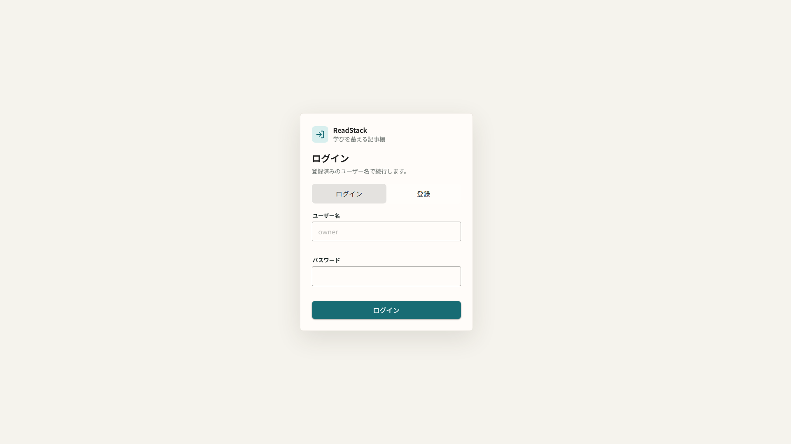
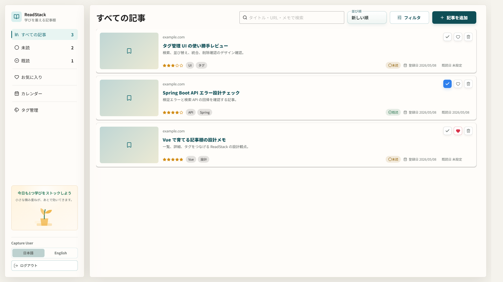
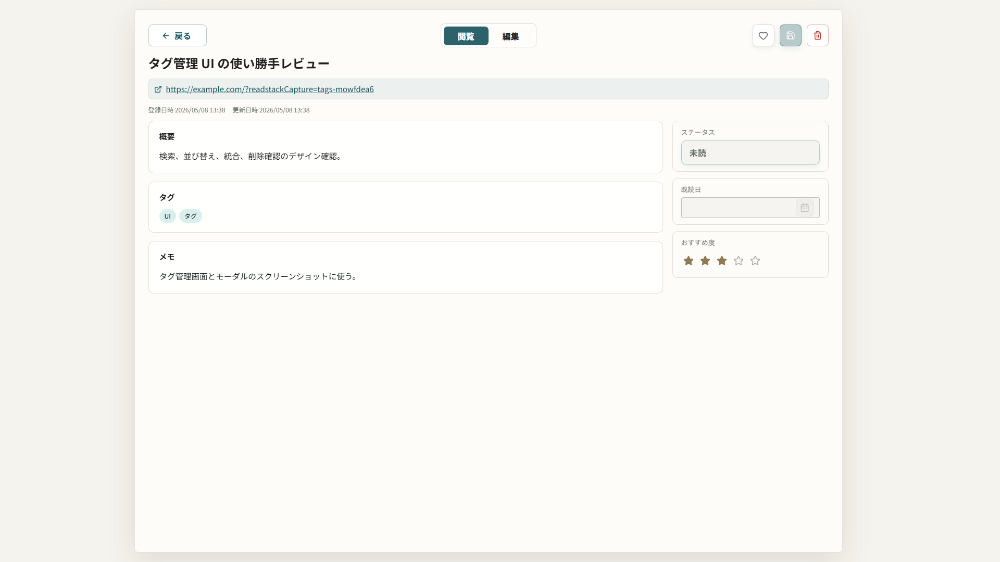
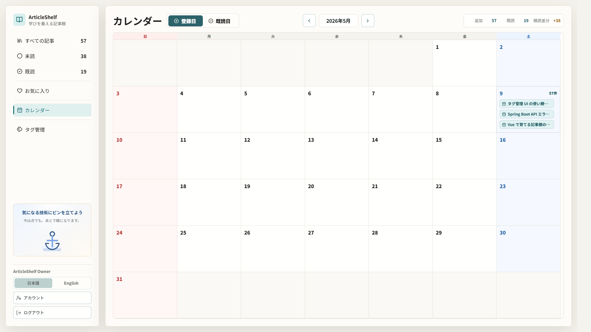
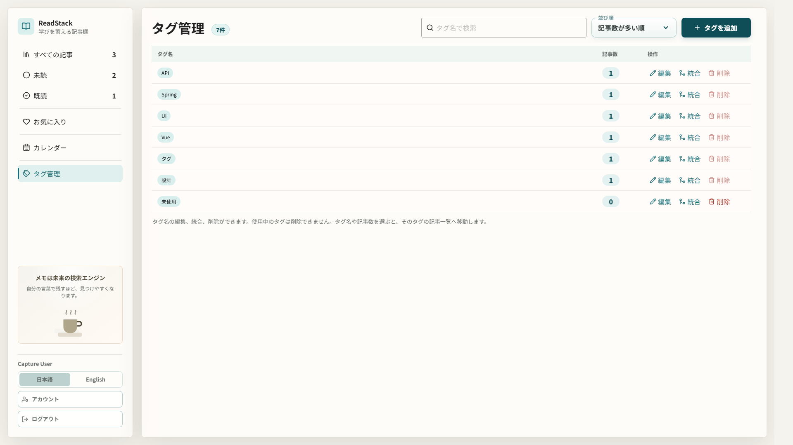
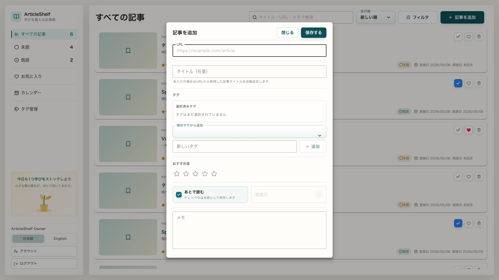
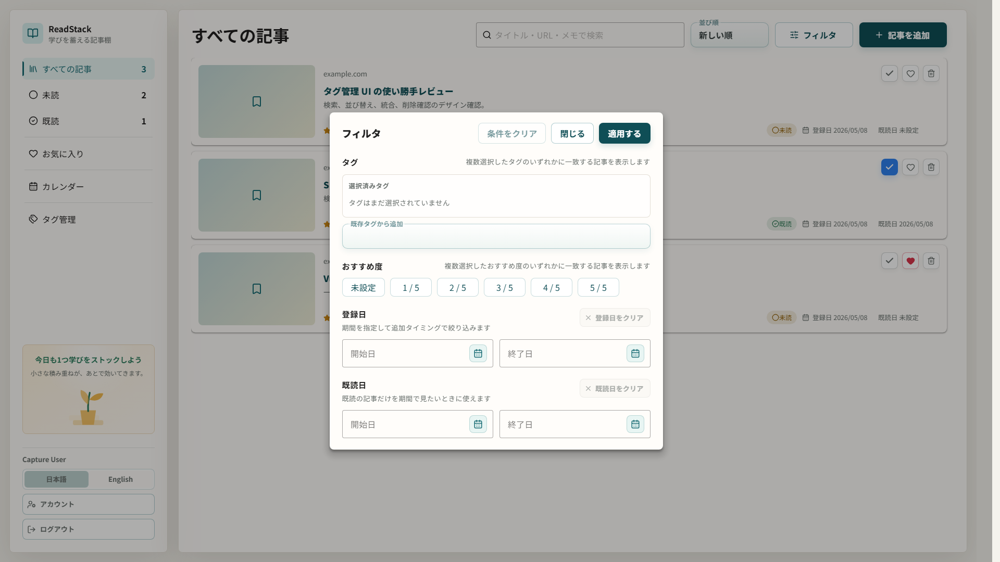
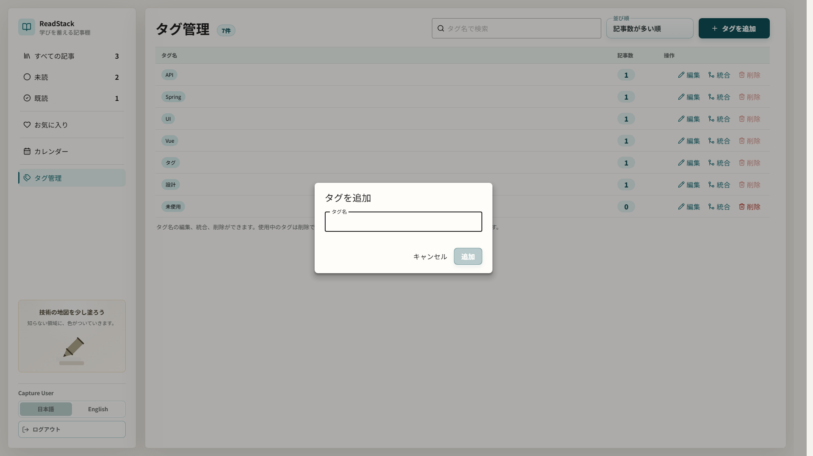
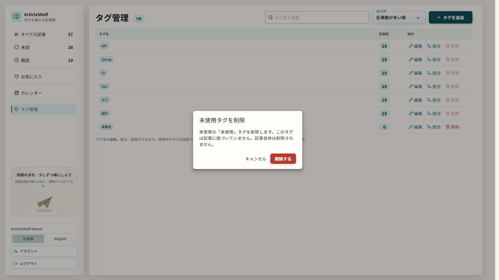
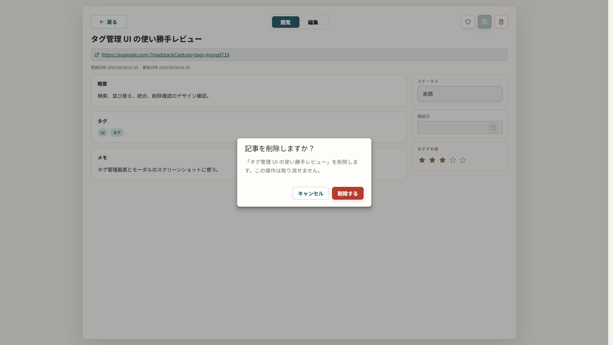

# ReadStack

ReadStackは、URLからOGPを取得して読んだ記事をストックし、学習や仕事の資産として整理・管理するアプリです。

## 目的

ReadStackは、単なる“あとで読む”リストではなく、読んだ記事を振り返りやすい「学習資産」に変えるアプリです。記事とメモを一体化して、技術情報の蓄積と再利用を支援します。

## コンセプト

- 記事URLを入力してOGPを取得し、読んだ技術記事をストック
- 記事のURL / タイトル / タグ / メモ / 既読日を一元管理
- 既読状況やお気に入り、タグで振り返りや検索を高速化
- ユーザー登録 / ログインにより、自分が登録した記事だけを管理
- 日本語 / English の表示切替に対応し、初期表示はブラウザ言語から判定
- デスクトップ利用を中心にしたUI設計

## 主要機能

- 記事追加（URL、タイトル、タグ、メモ、既読日、おすすめ度、あとで読む）
- URL からの OGP 取得によるタイトル / 概要 / サムネイル補完
- 未読 / 既読ステータス、お気に入り、おすすめ度の切り替え
- タグ、検索、おすすめ度、登録日範囲、既読日範囲による絞り込み
- 登録日 / 更新日 / 既読日 / タイトル / おすすめ度での並び替え
- 記事詳細ビューで概要、タグ、メモ、ステータス、既読日、おすすめ度を確認・編集
- 月ごとの追加日 / 既読日を確認できるカレンダー表示
- OGPサムネイル画像のブラウザ内 IndexedDB キャッシュ
- 学習継続を促すサイドバー下部の画像付きメッセージ
- サイドバーからの日本語 / English 切替と表示言語の端末保存
- ユーザー登録 / ログイン / ログアウト
- JWT access token と refresh cookie によるセッション継続

## 画面イメージ

スクリーンショットは `1920x1080`、ブラウザ locale `ja-JP` で取得しています。デザイン確認用のキャプチャは `cd frontend && npm run capture:designs` で再生成できます。

### ログイン

### ホーム / すべての記事一覧

### 記事詳細ビュー

### カレンダー

### タグ管理

### 記事追加モーダル

### フィルタモーダル

### タグ追加モーダル

### タグ統合モーダル

### タグ削除確認

### 記事削除確認

モバイル表示対応は未対応です。スマホ対応の検討内容は [docs/designs/mobile-responsive.md](docs/designs/mobile-responsive.md) に整理しています。

## 使い方

1. `docker compose up --build` で起動する
2. `http://localhost:5173` を開く
3. 画面の「登録」からユーザーを作成する、または初期ユーザーでログインする
4. 「記事を追加」から URL を入力して保存する
5. 一覧、フィルタ、カレンダー、タグ管理、詳細編集で記事を整理する
6. サイドバー下部の言語切替から日本語 / English を切り替える

ローカル開発用の初期ユーザーは `owner@example.com` / `password123` です。環境変数 `READSTACK_INITIAL_USER_EMAIL` と `READSTACK_INITIAL_USER_PASSWORD` で変更できます。

## 技術スタック

- フロントエンド: Vue.js + TypeScript + Vuetify
- バックエンド: Java / Spring Boot
- データベース: PostgreSQL
- 実行環境: Docker / Docker Compose
- API: REST API
- UI: Vuetify とカスタムCSSを組み合わせたデスクトップ向けUI

## 推奨バージョン

- Node.js は `22 LTS` を基準にする
- Java は `21 LTS` を基準にする
- PostgreSQL は `18` 系を使う
- Spring Boot は `4.0.x` を使う

ローカルの目安として `.nvmrc` は `22`、`.java-version` は `21` を置いています。Docker と CI も同じ基準に揃えています。

## 開発環境

### 起動URL

- フロントエンドは `http://localhost:5173` で起動する
- API は `http://localhost:8080` で起動する

### Docker / DB

- 開発時は `docker compose up --build` でフロントエンド、バックエンド、PostgreSQL をまとめて起動する
- PostgreSQL も Docker Compose で起動し、バックエンドからコンテナ間通信で接続する
- フロントエンドは Vite のホットリロードに対応し、`frontend/src` などの変更がブラウザへ反映される
- フロントエンドは Node.js `22 LTS` ベースの Docker イメージを使い、`package-lock.json` に合わせて `npm ci` を前提に依存を揃える
- バックエンドは Spring Boot DevTools と Maven compile 監視により、Java / resources の変更後に自動で再起動される
- バックエンドは Java `21 LTS` ベースの Docker イメージでビルド / 実行する
- バックエンド起動時は Flyway migration を先に適用し、その後 JPA `validate` で schema ずれを検知する

### Maven / 確認

- Maven はローカルに直接インストールして使う前提ではなく、確認やビルドは Docker 上の `backend` コンテナ経由で実行する
- 例: テストは `docker compose exec backend mvn test`、パッケージ確認は `docker compose exec backend mvn -DskipTests package`

### PostgreSQL 18 volume

- PostgreSQL 18 は旧 data volume と互換性がないため、Compose では `postgres-data-v18` volume を使う。旧 `postgres-data` は削除せず残るので、必要なデータは別途 export / migrate する

### 環境変数

- 認証関連の主な環境変数は `JWT_ACCESS_SECRET`, `AUTH_REFRESH_TOKEN_HASH_SECRET`, `AUTH_COOKIE_SAME_SITE`, `AUTH_COOKIE_SECURE`, `AUTH_CSRF_ENABLED`, `READSTACK_INITIAL_USER_EMAIL`, `READSTACK_INITIAL_USER_PASSWORD`
- 本番相当では `SPRING_PROFILES_ACTIVE=prod` と `FRONTEND_ORIGIN`, `SPRING_DATASOURCE_URL`, `SPRING_DATASOURCE_USERNAME`, `SPRING_DATASOURCE_PASSWORD` を必須で与える
- managed PostgreSQL を使う場合は `SPRING_DATASOURCE_URL=jdbc:postgresql://.../readstack?sslmode=require` のように JDBC URL 側で TLS を有効化する

## テスト

- バックエンド UT / IT: `docker compose run --rm backend mvn test`
- バックエンド静的解析: `docker compose run --rm backend mvn clean compile spotbugs:check`
- フロントエンド UT: `cd frontend && npm run test:unit`
- フロントエンド integration: `cd frontend && npm run test:integration`
- E2E: `cd frontend && npm run test:e2e`
- フロントエンド build: `cd frontend && npm run build`

E2E は Playwright と Docker Compose を使い、登録、重複 URL、詳細編集、削除、既読 / 未読切り替え、検索 + タグ + おすすめ度フィルタ、ログアウト / ログイン、ユーザー分離、他ユーザーによる更新 / 削除拒否まで確認します。Playwright は必要に応じて `docker compose -f docker-compose.e2e.yml up --build` を起動し、Compose は `/actuator/health` でバックエンドの起動完了を待ってからフロントエンドを起動します。ローカルで既に起動中のサーバーがある場合だけ再利用します。
既に `docker-compose.e2e.yml` のサーバー群を起動済みで、Playwright に起動処理を触らせたくない場合は `PLAYWRIGHT_USE_EXISTING_SERVER=1 npm run test:e2e -- authenticated-articles.spec.ts` のように既存サーバー専用モードで流せます。
フロントエンド UT には Markdown 表示の安全化テストを含め、バックエンド側は H2 ベース IT に加えて PostgreSQL 実体 + Flyway migration の persistence IT も追加しています。

## 開発補助

- Codex 用のプロジェクト skill は `.codex/skills/` に配置している
- UI 調整では `.codex/skills/readstack-ui-polish/SKILL.md` と `docs/designs/README.md` を参照する
- 実装とドキュメントの同期確認では `.codex/skills/readstack-change-sync/SKILL.md` を参照する
- `docs/designs/screenshots/` の現行スクショ更新では `.codex/skills/readstack-design-capture/SKILL.md` を参照する
- Git hooks は `.githooks/` に配置している
- 初回だけ `git config core.hooksPath .githooks` を実行すると、コミット前にフロントエンド型チェックと軽い運用ルール確認が走る
- フロントエンド単体の型チェックは `cd frontend && npm run typecheck` で実行できる
- フロントエンド単体テストは `cd frontend && npm run test:unit` で実行できる
- ブラウザ E2E テストは `cd frontend && npm run test:e2e` で実行できる
- デザイン画像の再取得は `cd frontend && npm run capture:designs` で実行できる
- ブラウザ挙動の手動検証には `frontend` の `@playwright/test` を利用できる

## CI

- GitHub Actions で push / pull request ごとに CI を実行する
- CI は `check -> unit -> integration -> e2e` の4段階で実行する
- `backend-check` は `docker compose run --rm backend mvn clean compile spotbugs:check` と `CleanArchitectureDependencyTest` を実行し、コンパイル、SpotBugs、クリーンアーキテクチャ依存方向を確認する
- `frontend-check` は Node.js `22 LTS` で `npm ci`、`npm run typecheck`、`npm run build` を実行し、型チェックと Vite ビルドを確認する
- `backend-unit` / `frontend-unit` は backend の純粋な JUnit UT と frontend の Vitest UT を分けて実行する
- `backend-integration` / `frontend-integration` は Spring Boot / PostgreSQL を使う backend IT と、`*.integration.test.ts` の Vitest integration test を分けて実行する
- E2E は integration 完了後に Playwright Chromium で P0 導線を確認する
- `main` / `develop` では全ジョブを実行し、それ以外のブランチでは backend / frontend / E2E の対象パス変更に応じて関連ジョブだけを実行する
- E2E 失敗時は Compose logs と Playwright report / trace artifact を保存して調査しやすくする
- Dependabot は `.github/dependabot.yml` で npm、Maven、GitHub Actions、Docker、Docker Compose の依存関係を週次確認する

## 現状整理

- プロジェクトの進捗と残作業は [docs/status/project-status.md](docs/status/project-status.md) に整理しています
- 優先度つきの残タスク一覧は [docs/status/task-backlog.md](docs/status/task-backlog.md) に整理しています
- テスト戦略は [docs/testing/README.md](docs/testing/README.md) に整理しています
- ユーザー登録・ログイン・JWT認証の実装と設計は [docs/specification/authentication.md](docs/specification/authentication.md) に整理しています
- 無料枠を中心にした公開・CI/CD構成案は [docs/deployment/free-deployment.md](docs/deployment/free-deployment.md) に整理しています
- スマホ対応デザイン検討は [docs/designs/mobile-responsive.md](docs/designs/mobile-responsive.md) に整理しています

## 今後の拡張案

- OCRや画像解析による自動記事抽出
- ブラウザ拡張やクリップボード入力の支援
- OGPサムネイルの手動再取得や画像保存先の拡張
- AI要約機能
- メール確認、パスワードリセット、全端末ログアウト
- 学習ログとの連携
