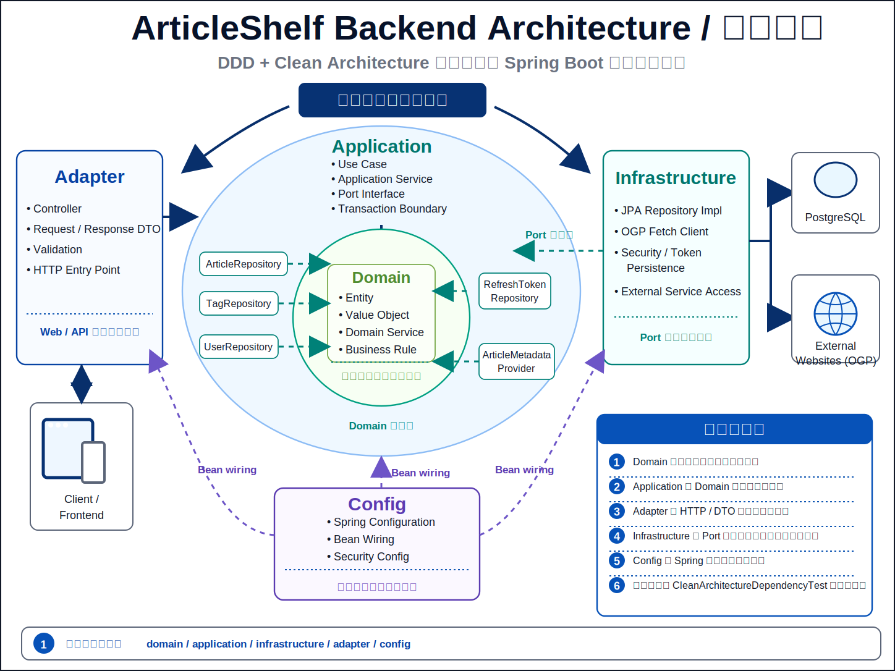

# Backend Architecture

バックエンドは DDD / クリーンアーキテクチャの考え方で実装します。
依存関係は内側から外側へ流れるように設計し、ドメインモデルが中心になります。

この図は `domain`、`application`、`adapter`、`infrastructure`、`config` の責務境界と、Port / 実装 / Spring wiring の依存方向を示す。
詳細な依存ルール、パッケージ構成、品質ゲートは、この README と testing / CI docs を正本とする。

## レイヤー構成

- `domain`: ドメインモデル、集約、値オブジェクト、ドメインサービス、リポジトリインターフェース
- `application`: ユースケース、アプリケーションサービス、DTO、外部機能を抽象化するポート（インターフェース）
- `infrastructure`: 永続化実装、外部APIクライアント、OGP取得、リポジトリ実装
- `adapter`: Web/API レイヤー、コントローラー、HTTP 入力/出力のマッピング
- `config`: Spring の設定、CORS、Bean 定義
- `infrastructure.security`: Spring Security、Spring Security JOSE による JWT 発行 / 検証、refresh token hash、password encoder

## DDDの依存関係ルール

- `domain` はどのレイヤーにも依存しない
- `application` は `domain` に依存する
- `infrastructure` は `application` と `domain` のインターフェースに依存する
- `adapter` は `application` のユースケースに依存し、`domain` を直接扱わない
- `dto` は API 入出力とアプリケーション境界のために使う
- `backend/src/test/java/com/articleshelf/architecture/CleanArchitectureDependencyTest.java` で、`domain` から外側の層や Spring/Jakarta への依存、`application` から `adapter` / `infrastructure` / `config` への依存、`adapter` から `infrastructure` / `config` への依存、`infrastructure` から `adapter` への依存を検査する
- GitHub Actions の `backend-check` job は `docker compose run --rm backend mvn test -Dtest=CleanArchitectureDependencyTest` を実行するため、この依存関係チェックも CI で必ず実行される

## Backend 品質ゲート

backend の CI は、構造の崩れ、静的解析の指摘、ドメイン / アプリケーション層のテスト不足、PostgreSQL 方言差、主要導線の破壊を段階的に検知する。

- `backend-check`: Docker 経由の Maven で compile、SpotBugs、Clean Architecture dependency test を実行する
- `backend-unit`: domain / application を中心に UT を coverage 付きで実行し、JaCoCo CSV から domain / application line coverage 80% 以上を要求する
- `backend-integration`: Spring Boot と PostgreSQL 実体を使い、認証境界、Repository 検索、DB 制約、JPA validate を確認する
- `e2e`: backend / frontend / DB を Compose で起動し、記事追加や認証を含む P0 導線を Playwright Chromium で確認する

CI の段階構成とコマンドは [CI / CD Architecture](../ci-cd/README.md)、テストの役割分担は [テスト戦略](../../testing/README.md) を正本とする。

## パッケージ構成

- `com.articleshelf.domain.article`
  - `Article` (集約ルート)
  - `Tag` (値オブジェクト／エンティティ)
  - `ArticleUrl` / `ArticleRating` / `TagName` (入力正規化と domain-level 制約を表す値オブジェクト)
  - `ArticleRepository` (インターフェース)
  - `TagRepository` (タグ管理用インターフェース)
- `com.articleshelf.application.article`
  - `ArticleService` (Controller 互換の facade)
  - `AddArticleUseCase` / `PreviewArticleUseCase` / `UpdateArticleUseCase` / `DeleteArticleUseCase`
  - `SearchArticlesQuery` / `FindArticleQuery`
  - `ArticleTagResolver` / `ArticleUrlUniquenessGuard`
  - `TagService` (タグ一覧、作成、名称変更、マージ、未使用タグ削除)
  - `AddArticleCommand`
  - `ArticleResponse`
  - `ArticleMetadataProvider` (OGP 取得など外部メタデータ取得のポート)
- `com.articleshelf.application.auth`
  - `AuthService`
  - `RefreshTokenRotationService` (refresh token 発行、rotation、reuse detection、CSRF token 発行)
  - `InitialUserProvisioner` (初期管理ユーザー作成)
  - `AuthUserRepository` / `RefreshTokenRepository` (認証永続化ポート)
  - `AccessTokenIssuer` / `RefreshTokenSecretService` / `PasswordHasher` / `IdGenerator` (セキュリティ実装と実行環境依存値のポート)
- `com.articleshelf.infrastructure.persistence`
  - `ArticleEntity`
  - `JpaArticleRepository` (ArticleRepository 実装。記事保存・検索と article-tag link 解決を担当)
  - `JpaTagRepository` (TagRepository 実装。タグ一覧、作成、rename、merge、未使用タグ削除を担当)
  - `JpaAuthUserRepository`
  - `JpaRefreshTokenRepository`
- `com.articleshelf.infrastructure.ogp`
  - `OgpClient`
  - `OgpService` (ArticleMetadataProvider の実装)
- `com.articleshelf.adapter.web`
  - `ArticleController`
  - `TagController`
  - `AuthController` / `UserController` は request DTO と use case 呼び出しを担当し、session cookie 発行 / 削除は `SessionCookieWriter`、CSRF 検証は `CsrfTokenValidator` に委譲する
  - `ArticleRequestMapper` は article request DTO から application command への変換を担当する
  - `ClientRequestContext` は User-Agent と client IP の取得を集約し、client IP は `ClientIpResolver` が解決する
  - `AuthAttemptGuard` は register / login の rate limit 呼び出しを Controller から分離する

## ドメイン中心の実装方針

- `Article` と `Tag` をドメインオブジェクトとして扱う
- `Article` は `updateContent`、`changeStatus`、`changeFavorite`、`changeRating`、`replaceTags` で更新時の状態変更を表現し、アプリケーション層が更新用に集約を丸ごと作り直さない
- URL、rating、tag name の trim、空値拒否、rating clamp などの基本ルールは `ArticleUrl`、`ArticleRating`、`TagName` に閉じ込める
- URL/OGP取得ロジックはインフラ層で実装し、アプリケーション層は `ArticleMetadataProvider` ポート経由で呼び出す
- OGP 取得時の SSRF 対策、redirect、body size、Content-Type 制限などの具体仕様は [セキュリティ仕様](../../specs/security/README.md) を正本とする
- 記事ユースケースは `AddArticleUseCase`、`PreviewArticleUseCase`、`UpdateArticleUseCase`、`DeleteArticleUseCase`、`SearchArticlesQuery`、`FindArticleQuery` に分け、`ArticleService` は既存 Controller 契約を保つ薄い facade として各ユースケースへ委譲する
- タグ解決は `ArticleTagResolver`、URL 重複チェックは `ArticleUrlUniquenessGuard` が担当し、記事追加 / 更新ユースケースで同じルールを使う
- タグ管理ユースケースは `TagService` に分け、コントローラーも各サービスへ直接委譲する
- 永続化と記事一覧の基本検索条件（ステータス、単一タグ、検索語、お気に入り）は `ArticleRepository` / `JpaArticleRepository` 経由で扱い、`ArticleListQuery` の `page` / `size` / `sort` は infrastructure 側で PostgreSQL の `LIMIT` / `OFFSET` / `ORDER BY` に変換する。タグ一覧・名称変更・マージ・未使用削除は `TagRepository` / `JpaTagRepository` 経由で扱う
- 認証ユースケースは `AuthService` を入口にしつつ、refresh token rotation は `RefreshTokenRotationService`、初期管理ユーザー作成は `InitialUserProvisioner` に分ける。JPA Entity、Spring Data Repository、JWT発行、refresh token hash、password encoder は application 層のポート越しに扱う。JWT の署名・検証・`exp` 検証・`alg` 扱いは自前実装せず、`spring-security-oauth2-jose` の encoder / decoder に委譲する
- 認証ユースケースの時刻、UUID、CSRF token 用 random source は `Clock`、`IdGenerator`、`SecureRandom` Bean として注入し、token rotation や invalidation のテストで固定値を使えるようにする
- API層は DTO を受け取り、アプリケーションサービスに変換して処理する
- API層の session cookie / CSRF の HTTP 詳細は dedicated adapter component に集約し、Controller に重複実装しない
- request DTO から application command への変換や client context 取得は adapter 内の helper / mapper に寄せ、Controller は HTTP 入出力と use case 呼び出しに集中させる

## 実装上の分離ポイント

- URLからOGP取得はバックエンドで実装済みで、外部取得は `ArticleMetadataProvider` ポート越しに扱う
- ユーザー認証を追加し、記事 / タグ API は user scoped repository で分離済み。`article_tags.user_id` と複合 FK も導入し、DB レベルでも article / tag の user mismatch を拒否する

## Logging Design

- request 単位の追跡は adapter / infrastructure の横断 concern として扱い、Controller や use case が個別に logger context を組み立てない
- `X-Request-Id` の受領、未指定時の生成、response header 返却、MDC `requestId` 設定は共通 filter / interceptor に集約する
- request / response logging は `method`、`path`、`status`、`durationMs`、認証済み user の内部 ID または anonymous 状態、結果種別を中心に構造化し、body 全文や token を記録しない
- exception logging は API error response と同じ `requestId` で追跡できるようにし、stack trace の多重出力や controller ごとの重複 logging を避ける
- auth、rate limit、OGP 取得、記事 / タグ更新のような高価値イベントは metrics を第一候補にし、調査で時系列が必要な失敗だけを構造化ログで補う
- frontend 側から backend に問い合わせる障害では、API error handling が返した `X-Request-Id` を UI / 外部収集側で参照できる前提を置き、backend logging と切り分け可能にする
- ログ項目は allowlist 方式で管理し、password、token、Cookie、CSRF token、記事本文、メモ本文、検索語全文、外部 URL query 全文は backend logger の責務としても出力しない
- local development、CI、本番で appender や log level を切り替えても、出力項目と redaction ルール自体は環境で変えない
