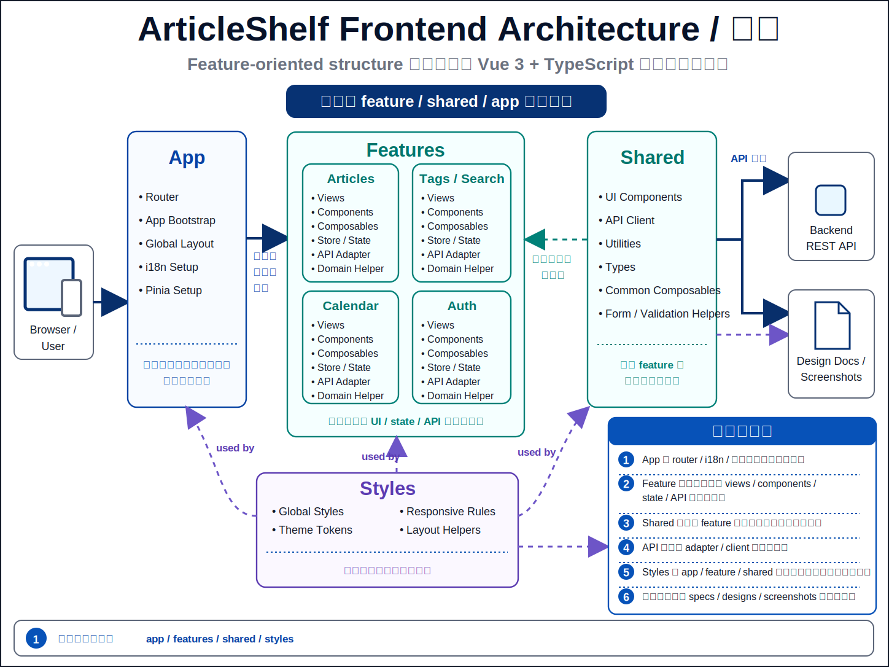

# Frontend Architecture

この図は `app`、`features`、`shared`、`styles` の責務境界と、Backend REST API / design docs への接続を示す。
詳細な責務と実装上の判断は、この README と design docs / specs を正本とする。

## レイヤー構成

- `features/articles`: 記事管理機能の画面、コンポーネント、Pinia store、API adapter、ドメイン helper
- `features/auth`: ユーザー登録 / ログイン画面、auth route view、認証 API adapter、access token を保持する Pinia store
- `features/articles/views`: protected workspace route view と、一覧 / カレンダー / 詳細を切り替える feature workspace
- `features/articles/components`: 記事カード、詳細、追加モーダル、フィルタ、サイドバー、workspace shell など記事機能の UI
- `features/articles/composables`: feature 内の表示状態、画面遷移、記事操作、タグ操作、詳細フォーム、account 操作、ローテーションなど UI ロジック
- `features/articles/data`: 学習継続カードなど feature 固有の静的データ
- `features/articles/domain`: フィルタ、ソート、フォーム変換、API 入力変換など副作用を持たない関数
- `features/articles/api`: 記事 / タグ API を型付きで呼び出す feature adapter
- `app/providers`: Pinia、i18n、Vuetify theme / defaults / locale messages など app-level provider 設定
- `app/providers/router`: lazy-loaded route 定義、guest / protected navigation guard、browser history 設定
- `shared`: JWT 付与 / refresh retry 対応の API client、共通 UI、IndexedDB キャッシュ、日付 formatting、i18n messages など機能横断の部品
- `styles`: design token、base、layout、controls、feature styles、responsive を責務単位で分割
- `App.vue`: Vuetify アプリの最上位 shell、auth 初期化待ち表示、`router-view` の配置
- `Vuetify`: ボタン、入力、カード、ダイアログ、チップなどのUIコンポーネント
- `frontend/public/_headers`: Cloudflare Pages 用の frontend security header 正本。static asset 配信時の CSP / nosniff / HSTS などをここで管理する

## 責務分割

- 表示状態と画面操作は feature の view / component に閉じる
- API 通信は feature adapter または shared API client に集約する
- API / 通信エラーの HTTP status、API `messages`、重複記事 ID、refresh retry、通信失敗、5xx の汎用化は `shared/api/client` が担当する
- store / composable は `shared/errors` の `errorMessage` で表示文言を取り出し、一覧、タグ管理、追加モーダル、詳細画面など表示先に応じた error state へ入れる
- API client は 5xx や malformed success response の内部詳細を画面へ出さず、i18n の汎用メッセージに変換する
- 画面遷移、未保存警告、記事操作、タグ操作、詳細フォーム、タグ管理の検索 / 並び替え / ダイアログ状態など、複数要素にまたがる UI ロジックは feature composable に切り出す
- protected route の outer shell は `ArticleWorkspaceShell` が担当し、desktop sidebar、mobile drawer、bottom navigation を一箇所で持つ。記事詳細も shell の内側で描画し、一覧起点かカレンダー起点かの navigation 文脈を保つ
- `ArticleWorkspace.vue` は route に応じた list / calendar / tags / detail の切り替えと feature 間の配線に寄せ、account dialog や logout state reset は `useWorkspaceAccountActions` が所有する
- `useArticlesStore` の記事一覧 state は `articles` を canonical source とし、検索 / フィルタ / ソート後の一覧は getter と `features/articles/domain` の純粋関数で派生させる
- `useArticlesStore` は list page 用の current page response と、カレンダー / サイドバー件数 / 一部遷移互換のための `articleSnapshot` を分けて持つ
- optimistic update / rollback は canonical な `articles` と `selectedArticle` だけを復元対象にし、同じ記事一覧を別配列で二重保持しない
- 記事更新 input は article `version` を含み、詳細画面の `useArticleActions` は `ARTICLE_VERSION_CONFLICT` を検知したときだけ競合 article ID を保持して「最新を読み直す」導線を出す。フォームドラフトは reload するまで保持する
- 検索、フィルタ、ソート、フォーム変換などの純粋処理は `features/articles/domain` に置く
- feature 固有の静的文言や表示候補は `features/articles/data` に置き、component / composable から生成関数越しに参照する
- 画像 Blob キャッシュ、日付 formatting、認証付き fetch など機能横断の処理は `shared` に置く
- feature の表示 component が図形や状態管理を大きく抱える場合は、専用 component / composable に分ける
- i18n 文言は locale ごとに `shared/i18n/messages/` 配下へ分割し、`shared/i18n/messages.ts` は集約 export にする

## Design Highlights

- feature-oriented: `features/articles` と `features/auth` に画面、API adapter、store、composable、domain helper をまとめ、機能内の変更理由を近くに置く
- app providers: `main.ts` は Vue app 作成と provider 登録に集中し、Pinia、i18n、Vuetify の設定は `app/providers` に分ける
- CSP-aware styling: app 固有の配色や可変幅は class / static CSS で表現し、element の inline `style` 属性へ依存しない。Vuetify theme runtime が必要とする `<style>` 注入だけを CSP の `style-src-elem` で許可する
- router-backed workspace: `/login`、`/register`、`/articles`、`/articles/:id`、`/calendar`、`/tags`、`/settings` を Vue Router で定義し、guest route は `AuthRouteView`、protected route は `WorkspaceRouteView` を lazy load する。認証状態に応じた redirect は router guard に寄せる
- article form split: 詳細ページの閲覧セクション、メモ編集 / preview、追加モーダルの create form state は dedicated component / composable に分ける
- shared boundary: 認証付き fetch、共通 UI、i18n、日付 formatting、IndexedDB cache のような横断処理だけを `shared` に置く
- auth-aware API client: `shared/api/client` が access token 付与、CSRF header、401 後の refresh retry、API error mapping、malformed response の汎用エラー化を担う
- auth session helpers: JWT `exp` decode は `shared/auth/jwt`、期限前 refresh timer は `features/auth/services/proactiveRefreshTimer` に分け、Pinia store は認証 state と API action に集中する
- cancellable requests: `shared/api/client` は `AbortSignal` を `fetch` へ渡せるため、検索や画面遷移で古い request を中断する導線を作れる
- client-side domain helpers: 検索、フィルタ、ソート、フォーム変換、Markdown rendering などは `features/articles/domain` の副作用を持たない関数へ寄せる
- UI measurement: タグ管理の select 幅など DOM 計測が必要な処理は dedicated composable に分け、タグ管理 state と DOM 依存を混ぜない
- workspace search debounce: 記事一覧検索の遅延反映は `useArticleSearchDebounce` に分け、workspace unmount や logout state reset 時に保留中の検索反映を cancel する
- workspace container boundaries: `WorkspaceRouteView` が protected route 入口、`ArticleWorkspaceShell` が app chrome、`ArticleWorkspace` が route-to-view orchestration を担当する。detail route でも shell は維持し、`detailReturnView` を使って sidebar / drawer の active state と back 導線を揃える。`useWorkspaceAccountActions` / `useWorkspaceNavigation` は cross-view state を分担する
- server-driven list query: 記事一覧は `filters + currentPage` を query state として `GET /api/articles` へ送り、`page` / `size` / `sort` と filter 群で current page だけを取得する。カレンダーや sidebar counts は互換用 snapshot を別 fetch する
- safe Markdown rendering: `renderMarkdown` は raw HTML を無効化した MarkdownIt 出力を DOMPurify で sanitization し、許可スキームや危険タグの境界は [セキュリティ仕様](../../specs/security/README.md) に従う
- responsive UX: desktop / tablet / mobile の見た目と操作は design docs を正本にし、代表導線は Playwright E2E と screenshot capture で確認する

## UI 方針との関係

- UI の共通方針は `docs/designs/README.md`、画面別コンポーネントルールは `docs/designs/components/README.md` を参照する
- デスクトップ、ノート PC、タブレット、スマホのレスポンシブ仕様は `docs/designs/responsive/README.md` を参照する
- スマホ固有の詳細仕様は `docs/designs/responsive/mobile.md` を参照する
- UI 変更時は design docs と `docs/designs/screenshots/README.md` の更新要否を確認する
